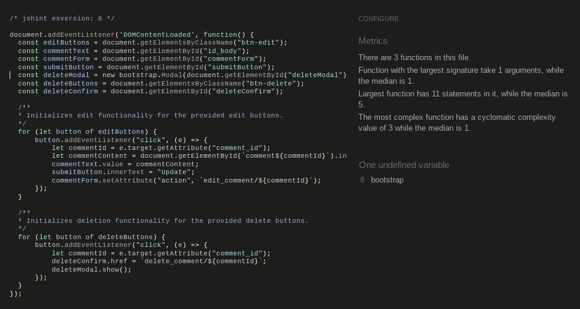

# Fitness Recipes | Testing

Back to the [README](README.md)

Comprehensive manual testing has been performed throughout the development of this webpage to ensure the seamless and optimal functionality of all features.

## Manual Testing
A total of 78 manual tests were structured in a document with the following topics:
-   Non-Authenticated User Tests
-   Authentication Tests
-   Authenticated User Tests
-   Like feature on recipes
-   Recipe Browsing and Filtering
-   Responsiveness Tests
-   Error Handling
-   Performance Tests
-   Security Tests
-   Admin Authentication
-   Recipe Management
-   Tag Management
-   User Management
-   Comment Moderation
-   Contact Form Messages
-   Admin Interface Customization
-   Image Handling
-   Admin Actions Logging

The document was structured as a Test schema into columns with Tests and Status.
Status have 4 options; Not started, Fail, Pass or Test Subject.

The document was used throughout the development process.
This is a snippet of that document:

At the time of finishing this project all tests were marked with Pass.

### [Link to the full Google test document can be found here](https://docs.google.com/spreadsheets/d/1L--W--hgOou8HRXE2FjazDIsixKQZULy3gec19Mxbpo/edit?usp=sharing)

## Testing User Stories
All user stories have been tested by making sure that the Acceptance Criteria has been met before closing it. For every test there is a box to tick when acceptance criteria has been reached.

[Link to the Project Kanban Board where all User Stories can be seen](https://github.com/users/SophieTiger/projects/4/views/1?visibleFields=%5B%22Title%22%2C%22Status%22%2C%22Labels%22%5D)

## Defensive programming
By implementing defensive programming techniques in critical areas of the application, important steps were taken to create a more robust, secure, and user-friendly system.
The following has been tested:

### User Authentication (Login/Logout):
- Tested login functionality with correct and incorrect credentials to ensure proper access control.
- Verified that logged-out users cannot access protected pages and functionality without authentication.
- Checked that the logout function effectively ends the user session and redirects to the appropriate page.
- Attempted to access authenticated-only areas after logout to confirm session termination.

### Comments on Recipes - CRUD:
- Posted comments as different users to verify proper attribution and display.
- Tested comment editing and deletion to ensure only the comment author can perform these actions.
- Confirmed that users cannot edit nor delete comments made by other users.
- Checked that edited comments display the updated content and an "updated" indicator.
- Checked that a confirmation of the update is displayed to the user when comment is updated.
- Checked that edited comments are updated in the page and in the database.
- Checked that a delete modal is shown to the user when they click "Delete" on comment. This delete modal asks the user again if the comment should be deleted.
- Checked that a confirmation of the deletion is displayed to the user when comment is deleted.
- Checked that deleted comments are removed from the recipe page and database.
- Attempted to submit comments with various inputs, including special characters and long text, to check input handling.
- Verified that non-logged-in users cannot post comments.

### Recipes - CRUD:
- Created new recipes and verified all input fields are correctly saved and displayed.
- Updated existing recipes to check that changes are accurately reflected in the database and on the site.
- Deleted recipes and confirmed they are removed from both the database and user interface.
- Made sure only admin users can create, update and delete recipes.

### Likes on Recipes:
- Tested liking functionality as different users to ensure likes are correctly recorded.
- Attempted to like the same recipe multiple times to verify that duplicate likes are prevented.
- Checked that the like count updates correctly and immediately upon user interaction.
- Verified that non-logged-in users cannot like recipes and are prompted to log in.

### General Testing:
- Verified that appropriate error messages are displayed for invalid actions or inputs.

### Chrome Developer Tools
Chrome developer tools were used throughout the development of the webpage to test responsiveness. Responsiveness was tested using developer Tools to emulate the following devices:

-   Desktop
-   Laptops
-   Tablets
-   Mobile phones

### Browser Testing
During the development of the webpage the testing was done using Google Chrome. In production the site has been tested on the following browsers:
-   Google Chrome
-   Mozilla Firefox
-   Safari

## Validation

### [W3C HTML Validator](https://validator.w3.org/)
Used to validate the HTML files.

Home page and recipes page:

About page showed an error:

### [W3C CSS Validator](https://jigsaw.w3.org/css-validator/)
Used to validate the CSS in the stylesheet style.css.

- No errors were found but warnings due to webkits are noted

### [JSHint JavaScript Validator](https://jshint.com/)
No errors displayed in the Javascript files.

comments.js:

likes.js:

### [CI Python Linter](https://pep8ci.herokuapp.com/)
The Code Institute Python Linter was used to validate and format all the python files neatly. All errors were fixed and no errors were found in the final tests.

Some of the warnings and errors that were found and fixed:

## Lighthouse Testing
Lighthouse audit reports were generated through Chrome DevTools to test the performance, accessibility, best practices and SEO of the website during the development of the website.

Lighthouse audit reports are as follows:

## Bugs
- Clicking like redirects to this url: https://8000-sophietiger-fitnessreci-yqclcmt1m47.ws.codeinstitute-ide.net/recipe/toffee-apple-overnight-oats/like/
and a blank screen with only a raw json response is shown: {"liked": true, "likes_count": 2, "message": "Toffee Apple Overnight Oats added to Favorites!"}
  - Added some JavaScript to prevent the default form submission and handle the AJAX response correctly. 
- Delete and Edit functionality on comments suddenly stopped working when site was almost finished.
  - Analyzed error messages in the devtools console, pointing me towards a ReferenceError that Bootstrap is not defined at comments.js.
  After googling and serching for answers I wrapped my comments.js code in a DOMContentLoaded event listener to make sure that code runs only after the HTML document has been completely loaded and parsed, and all scripts (including Bootstrap) are ready to use.
  https://developer.mozilla.org/en-US/docs/Web/API/Document/DOMContentLoaded_event
  
- Number of likes not changing on the recipe detail page when clicking the heart-like button.
  - Searching and googling for answers gave me the idea to implement Optimistic updates that should provide a smooth user experience, and error handling that ensures that the UI stays in sync with the server state.
  Inspiration and instructions from the following sources:
  https://realpython.com/django-and-ajax-form-submissions/
  https://stackoverflow.com/questions/33179762/django-ajax-like-button
  https://docs.djangoproject.com/en/4.2/topics/class-based-views/generic-editing/#ajax-example

- Message that is displayed when liking/unliking recipes is still shown on other pages after clicked down by the user on the recipe details page.
  - Solution: implement a solution that clears the message after it's displayed via AJAX. Modify Javascript and View, add a new view to clear messages and a new url to display the new view. This approach ensures that the messages are displayed immediately via AJAX and then cleared from Django's message storage, preventing them from appearing on subsequent page loads.
- At the moment no bugs left that I am aware of.

Back to the [README](README.md)